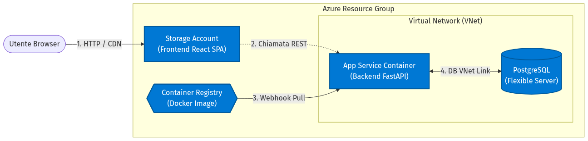
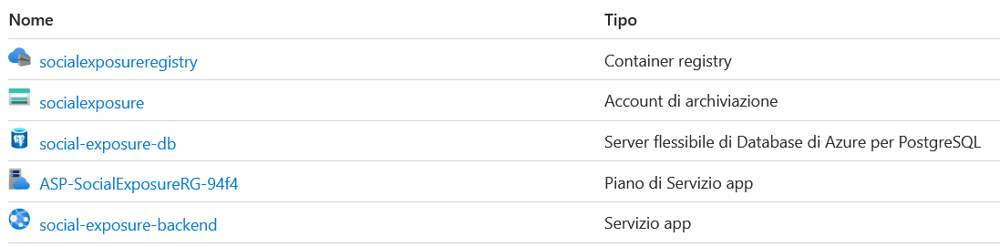
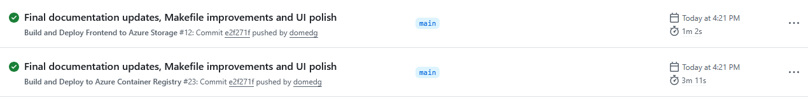
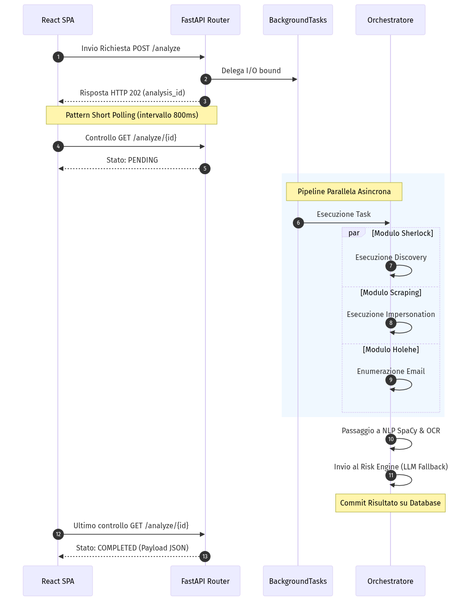
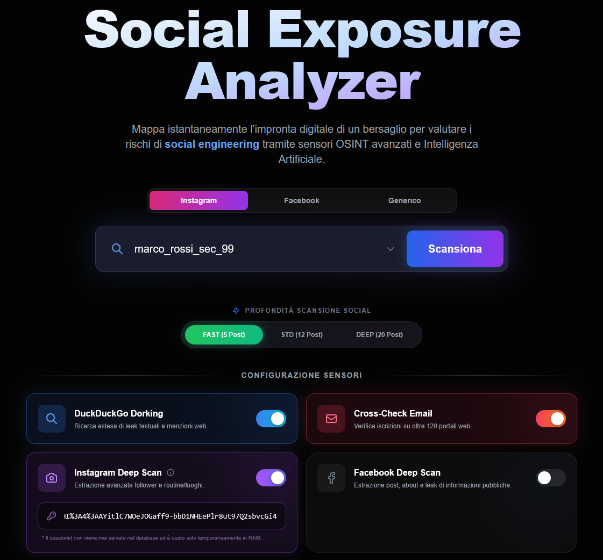
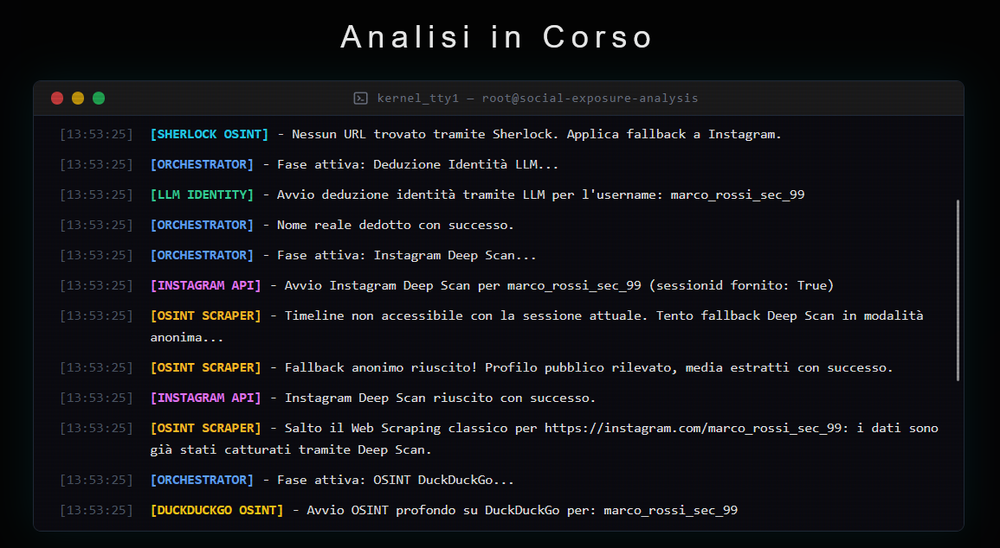
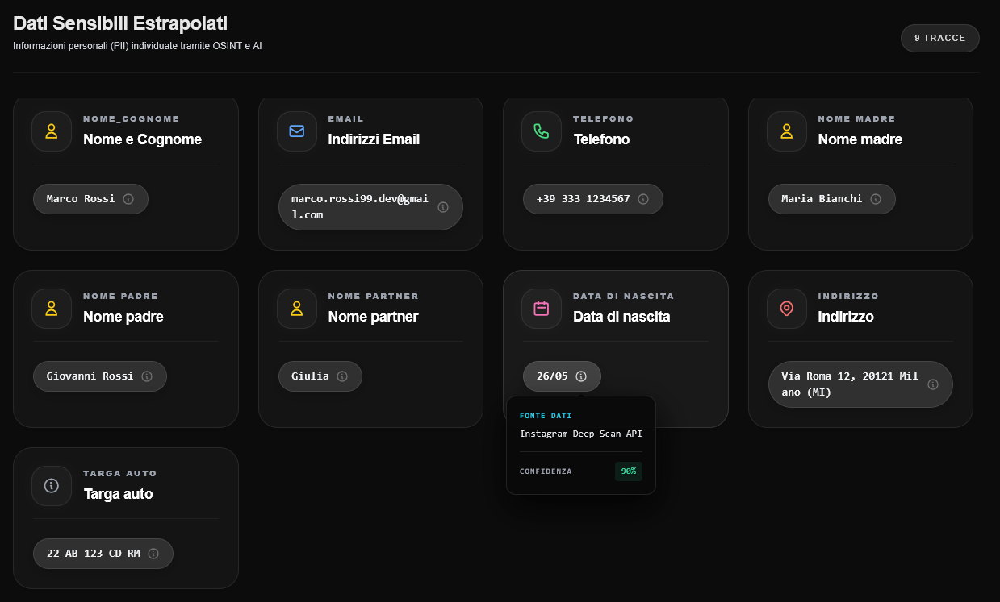
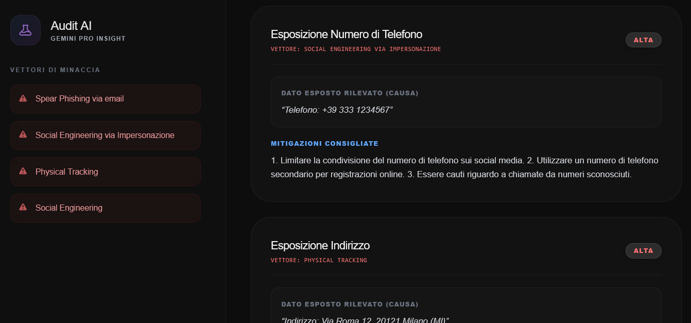

<style>
    body {
        font-family: 'Arial', 'Helvetica', sans-serif;
        font-size: 16px;
        line-height: 1.6;
        color: #111;
    }
    h1, h2, h3, h4 {
        color: #005A9E; /* Colore aziendale Microsoft Azure/Unical */
        page-break-after: avoid !important;
        break-after: avoid !important;
        page-break-inside: avoid !important;
    }
    h2 {
        margin-top: 50px;
        border-bottom: 1px solid #ddd;
        padding-bottom: 5px;
        page-break-before: always !important; /* Forza i capitoli su nuova pagina */
    }
    p, li {
        text-align: justify;
        margin-bottom: 15px;
        /* Rimosso page-break-inside: avoid per permettere al testo di fluire con il titolo */
    }
    a {
        color: #005A9E !important; /* Uniforma i colori dei link blu */
        text-decoration: none;
    }
    a:hover {
        text-decoration: underline;
    }
    .caption {
        text-align: center;
        font-size: 14px;
        font-style: italic;
        color: #555;
        margin-top: 10px;
        margin-bottom: 15px;
        page-break-inside: avoid !important;
        break-inside: avoid !important;
    }
    .figure-container {
        page-break-inside: avoid !important;
        break-inside: avoid !important;
        margin-bottom: 40px;
        display: inline-block !important;
        width: 100%;
        text-align: center;
    }
    pre {
        background-color: #282c34 !important;
        color: #abb2bf !important;
        border: none;
        padding: 16px;
        border-radius: 8px;
        font-family: 'Consolas', 'Courier New', monospace;
        font-size: 13px;
        line-height: 1.5;
        page-break-inside: avoid !important;
        break-inside: avoid !important;
        box-shadow: 0 4px 6px rgba(0, 0, 0, 0.3);
    }
    code {
        background-color: #f1f3f5;
        padding: 2px 4px;
        border-radius: 4px;
        color: #d63384;
        font-family: 'Consolas', 'Courier New', monospace;
    }
    pre code {
        background-color: transparent !important;
        color: inherit !important;
        padding: 0;
    }
    /* Syntax Highlighting Overrides for Dark Theme (Super Vibrant) */
    .hljs-keyword, .keyword { color: #ff7edb !important; font-weight: bold; }
    .hljs-string, .string { color: #a8ff60 !important; }
    .hljs-title, .title, .hljs-title.function_ { color: #54c8ff !important; font-weight: bold; }
    .hljs-comment, .comment { color: #8a99a8 !important; font-style: italic; }
    .hljs-built_in, .built_in { color: #ffd659 !important; font-style: italic; }
    .hljs-type, .type { color: #ffd659 !important; }
    .hljs-literal, .literal { color: #ff9d00 !important; }
    .hljs-number, .number { color: #ff9d00 !important; }
    .hljs-params, .params { color: #f8f8f2 !important; }
    .hljs-variable, .variable { color: #f8f8f2 !important; }
    .hljs-attr, .attr { color: #54c8ff !important; }
    .hljs-meta, .meta { color: #ff9d00 !important; font-weight: bold; }
    .hljs-operator, .operator { color: #ff7edb !important; }
    .hljs-property, .property { color: #54c8ff !important; }
    .hljs-punctuation, .punctuation { color: #abb2bf !important; }
</style>

<div style="text-align: center; margin-top: 15px;">
    
    <br><br>
    <div style="font-size: 34px; font-weight: bold; color: #111; line-height: 1.3; margin-bottom: 10px;">
        Relazione Progetto Sistemi Distribuiti & Cloud Computing
    </div>
    <div style="font-size: 24px; font-weight: 500; color: #444; margin-bottom: 25px;">
        "Social Exposure Analyzer"
    </div>
    
    <br><br>
    <div style="font-size: 18px; color: #111; line-height: 1.5;">
        <strong>Studente:</strong><br>
        Domenico Del Giudice<br>
        Mat. 276657<br>
        <br>
        <strong>GIUGNO 2026</strong>
    </div>
</div>

<div style="page-break-after: always;"></div>

## Indice

- [1. Intento e Analisi dei Requisiti](#1-intento-e-analisi-dei-requisiti)
- [2. Architettura Cloud e Deploy (Microsoft Azure)](#2-architettura-cloud-e-deploy-microsoft-azure)
  - [2.1 Erogazione del Frontend (Azure Storage Account - Static Web App)](#21-erogazione-del-frontend-azure-storage-account---static-web-app)
  - [2.2 Orchestrazione Backend e Compute (Azure App Service)](#22-orchestrazione-backend-e-compute-azure-app-service)
  - [2.3 Containerizzazione e Continuous Deployment (Azure Container Registry)](#23-containerizzazione-e-continuous-deployment-azure-container-registry)
  - [2.4 Persistenza Relazionale (Azure Database for PostgreSQL Flexible Server)](#24-persistenza-relazionale-azure-database-for-postgresql-flexible-server)
  - [2.5 Struttura delle Directory e Moduli di Progetto](#25-struttura-delle-directory-e-moduli-di-progetto)
- [3. Backend, Sincronia e Architettura Asincrona](#3-backend-sincronia-e-architettura-asincrona)
  - [3.1 Esecuzione Disaccoppiata (Pattern Produttore-Consumatore)](#31-esecuzione-disaccoppiata-pattern-produttore-consumatore)
  - [3.2 Moduli di Scraping e Meccanismi Anti-Bot](#32-moduli-di-scraping-e-meccanismi-anti-bot)
  - [3.3 Natural Language Processing (NLP) e Optical Character Recognition (OCR)](#33-natural-language-processing-nlp-e-optical-character-recognition-ocr)
- [4. Intelligenza Artificiale Generativa e Risk Engine Multilivello](#4-intelligenza-artificiale-generativa-e-risk-engine-multilivello)
  - [4.1 Ingegneria dei Prompt e Controllo JSON (Dati Strutturati)](#41-ingegneria-dei-prompt-e-controllo-json-dati-strutturati)
  - [4.2 High-Availability e Circuit Breaker (Pattern Fallback)](#42-high-availability-e-circuit-breaker-pattern-fallback)
  - [4.3 Calcolo Deterministico del Rischio (Algoritmo Matematico)](#43-calcolo-deterministico-del-rischio-algoritmo-matematico)
- [5. Frontend e Layer di Presentazione (React)](#5-frontend-e-layer-di-presentazione-react)
  - [5.1 Sincronizzazione Client-Server (Short Polling)](#51-sincronizzazione-client-server-short-polling)
- [6. Sicurezza, Privacy e Conformità](#6-sicurezza-privacy-e-conformità)
  - [6.1 Sicurezza Architetturale e Hardening (Cybersecurity)](#61-sicurezza-architetturale-e-hardening-cybersecurity)
  - [6.2 Transitorietà e Rispetto Legale del GDPR](#62-transitorietà-e-rispetto-legale-del-gdpr)
  - [6.3 Verifica e Testing Automatico](#63-verifica-e-testing-automatico)
  - [6.4 Utilizzo di Identità Sintetiche (Testing Etico)](#64-utilizzo-di-identita-sintetiche-testing-etico)
- [7. Utilizzo di AI Generativa nello Sviluppo](#7-utilizzo-di-ai-generativa-nello-sviluppo)
- [8. Conclusioni e Sviluppi Futuri](#8-conclusioni-e-sviluppi-futuri)

## 1. Intento e Analisi dei Requisiti
La presente relazione tecnica descrive le specifiche funzionali e le scelte ingegneristiche alla base dell'applicativo "Social Exposure Analyzer". 
Il sistema si prefigge l'obiettivo di automatizzare la raccolta, l'analisi e la validazione di dati provenienti da fonti aperte (**OSINT - Open Source Intelligence**, ovvero l'intelligence basata su dati accessibili pubblicamente su internet) al fine di quantificare l'esposizione al rischio di ingegneria sociale (Social Engineering) di uno specifico bersaglio.

A livello tecnico, il sistema è stato ingegnerizzato adottando il paradigma architetturale dei microservizi. Il Backend è sviluppato tramite il framework **FastAPI** in Python, scelto per le sue eccezionali performance nella gestione di workload asincroni. Il Frontend è realizzato in **React**, fungendo da client **SPA (Single Page Application)**, ovvero un'applicazione web che carica un'unica pagina HTML e aggiorna dinamicamente i contenuti senza mai forzare il ricaricamento completo del browser da parte dell'utente. 

L'intera infrastruttura è stata sottoposta a un processo di *Lift and Shift* (la migrazione di un applicativo su cloud senza alterarne l'architettura di base) verso paradigmi Cloud-Native sull'ecosistema **Microsoft Azure**, garantendo un'elevata affidabilità, automazione dei deploy e ottimizzazione dinamica dei costi.

## 2. Architettura Cloud e Deploy (Microsoft Azure)
In questa sezione verranno illustrate le decisioni architetturali strategiche intraprese per il deployment cloud. Per superare le limitazioni di un tradizionale hosting **IaaS (Infrastructure as a Service)** — un modello in cui si affittano macchine virtuali nude che devono essere configurate, aggiornate e mantenute manualmente dallo sviluppatore — si è optato per un ecosistema interamente governato da servizi **PaaS (Platform as a Service)**. Nel modello PaaS, il provider cloud (Azure) gestisce l'hardware, la rete e il sistema operativo, lasciando allo sviluppatore il solo compito di caricare e gestire il codice applicativo.

Tutte le risorse afferenti al progetto sono isolate logicamente all'interno di un **Resource Group** (`SocialExposure-RG`). Questa scelta architetturale permette di segregare i costi, definire policy IAM (Identity and Access Management, ovvero la gestione delle autorizzazioni) granulari e gestire il ciclo di vita (creazione e distruzione) di tutti i componenti come singola entità logica.

<div style="page-break-inside: avoid;">

<div class="figure-container">
    <div style="font-weight: bold; text-align: left; margin-bottom: 10px; font-size: 1.1em;">Schema Architetturale dell'Infrastruttura Cloud:</div>
    
    <div class="caption">
        <strong>Figura 1: Topologia di rete dell'infrastruttura Cloud Azure.</strong> Il diagramma illustra il flusso del dato (1): l'utente interroga la CDN fornita nativamente dallo Storage Account che ospita la Single Page Application React. Il layer di presentazione contatta (2) tramite chiamate asincrone il container Linux dell'App Service. Il ciclo di integrazione continua (3) è garantito dall'Azure Container Registry che inietta le immagini Docker tramite Webhook, mentre la persistenza (4) sfrutta la VNet Integration per interloquire a bassa latenza con il nodo PostgreSQL mascherando i flussi alla rete pubblica Internet.
    </div>
</div>
</div>

<div class="figure-container">
    
    <div class="caption">
        <strong>Figura 2: Portale Microsoft Azure - Resource Group del Progetto.</strong> La schermata mostra la raccolta logica delle risorse allocate nel cloud Azure per l'applicativo, inclusi l'App Service, l'App Service Plan, lo Storage Account e il Flexible PostgreSQL Server.
    </div>
</div>

### 2.1 Erogazione del Frontend (Azure Storage Account - Static Web App)
Il frontend dell'applicativo (React) viene preventivamente processato da un bundler (Vite) che genera file statici minificati (HTML, CSS, JS). 
Trattandosi di asset pre-compilati, l'utilizzo di un server web tradizionale (come Nginx o Apache) su una macchina virtuale rappresenterebbe uno spreco critico di risorse computazionali.
La soluzione adottata sfrutta il servizio **Azure Storage Account** (`socialexposure`), nello specifico la funzionalità di *Static Website Hosting*.
I file vengono ospitati come oggetti "Blob" in un contenitore dedicato (`$web`).

**Vantaggi Esecutivi:**
1. **Latenza di rete e CDN:** L'infrastruttura Azure distribuisce automaticamente gli asset sfruttando la propria dorsale **CDN (Content Delivery Network)**. Una CDN è una rete globale di server posizionati in vari punti del mondo che conserva copie cache dei file del sito; questo garantisce tempi di caricamento irrisori a prescindere da dove si trovi fisicamente l'utente. L'endpoint risultante è pubblico e auto-generato (`socialfrontend123.z38.web.core.windows.net`).
2. **Architettura Serverless:** In assenza di un runtime server-side da mantenere in esecuzione continua, i costi infrastrutturali scalano a zero, limitando la fatturazione ai soli megabyte di storage e trasferimento dati verso l'esterno (Bandwidth Outbound).

### 2.2 Orchestrazione Backend e Compute (Azure App Service)
La complessità computazionale del sistema, che include la gestione delle richieste API REST, il web scraping distribuito e l'orchestrazione dei modelli di intelligenza artificiale, è demandata alla risorsa `social-exposure-backend`, istanziata su un **Azure App Service per container Linux**.
Questa risorsa PaaS astrae completamente la gestione del Sistema Operativo sottostante (kernel patching, aggiornamenti di sicurezza), permettendo al team di focalizzarsi esclusivamente sulla *business logic*.

**Gestione delle Risorse (App Service Plan):**
La potenza elaborativa è definita dall'**App Service Plan** (`ASP-SocialExposureRG-94f4`). A differenza di un sistema fisico on-premise, questo piano definisce un bacino di risorse (vCPU e RAM) virtuali che l'App Service può consumare. La piattaforma consente configurazioni dinamiche di:
- **Scaling Up (Scalabilità Verticale):** Potenziamento istantaneo delle specifiche hardware del singolo server (es. da 2 a 4 CPU) senza dover riavviare o migrare manualmente l'infrastruttura.
- **Scaling Out (Scalabilità Orizzontale):** Moltiplicazione delle istanze del server in parallelo in base a metriche predefinite (es. se il carico CPU supera il 70% per oltre 5 minuti), rendendo il backend resiliente ai picchi improvvisi di traffico.

### 2.3 Containerizzazione e Continuous Deployment (Azure Container Registry)
Per evitare la fastidiosa problematica del "sul mio computer locale funzionava", l'intero ecosistema backend Python è stato impacchettato all'interno di un'immagine **Docker**. Il file `Dockerfile` codifica esplicitamente in testo le librerie di sistema necessarie, il runtime Python 3.x e le dipendenze software (FastAPI, SpaCy, Uvicorn). Questo approccio garantisce l'*Immutabilità dell'Ambiente*: il contenitore si comporterà nello stesso identico modo a prescindere dalla macchina che lo esegue.

L'artefatto compilato non viene esposto su registri pubblici, ma inviato in modo sicuro all'**Azure Container Registry (ACR)** (`socialexposureregistry`), un registro privato per la memorizzazione di immagini Docker offerto da Microsoft per ambiti aziendali.

**Integrazione CI/CD e Automazione GitHub Actions:**
Questa pratica automatizza in toto i rilasci del software. Al netto della configurazione iniziale (eseguita tramite file YAML nella cartella `.github/workflows`), lo sviluppatore è del tutto sollevato dal lancio manuale di build Docker o caricamenti di file. 
È sufficiente inviare il nuovo codice al repository tramite un banale `git push`. Questa singola azione agisce da "trigger" (grilletto) innescando dei server virtuali offerti da GitHub che:
1. Compilano il frontend React e lo iniettano nell'Azure Storage Account.
2. Costruiscono l'immagine Docker del backend e la inviano all'ACR.

A questo punto, l'App Service, che è nativamente agganciato all'ACR tramite **Webhook** (una notifica HTTP inviata al variare di un evento), riceve l'immagine, istanzia un nuovo container e, solo quando quest'ultimo è pienamente operativo (Zero-Downtime Deployment), inizia a indirizzarvi il traffico spegnendo l'istanza obsoleta senza causare interruzioni agli utenti.

<div class="figure-container">
    
    <div class="caption">
        <strong>Automazione GitHub Actions:</strong> La schermata certifica l'avvenuta esecuzione automatica e parallela dei workflow di "Build and Deploy" sia per il frontend che per il backend sul cloud Azure, attivati istantaneamente e in modo trasparente dal comando di push.
    </div>
</div>

### 2.4 Persistenza Relazionale (Azure Database for PostgreSQL Flexible Server)

La conservazione a lungo termine degli audit generati e delle configurazioni utente è demandata ad **Azure Database for PostgreSQL Flexible Server** (`social-exposure-db`).
L'architettura *Flexible Server* si distacca dai vecchi modelli rigidi per via della sua architettura a zone ad alta affidabilità. 

**Vantaggi Architetturali:**
- **Prossimità di Rete (VNet Integration):** Azure posiziona il cluster del database all'interno di una Virtual Network (VNet) dedicata, ovvero una rete virtuale privata isolata da internet, comunicante nativamente con l'App Service. Questo minimizza drasticamente i colli di bottiglia legati al *TCP Handshake* (il processo di sincronizzazione a tre vie necessario per stabilire una connessione internet sicura), offrendo prestazioni da rete locale (LAN).
- **Automazione Amministrativa:** Essendo una risorsa completamente gestita, il database si occupa autonomamente di routine di manutenzione critica quali l'*Auto-Vacuuming* (il recupero automatico dello spazio fisico sul disco lasciato vuoto a seguito di cancellazioni di record) e di generare backup incrementali automatizzati per consentire ripristini temporali (Point-in-Time recovery).

### 2.5 Struttura delle Directory e Moduli di Progetto
Per garantire la manutenibilità e favorire uno sviluppo modulare, il repository del progetto segue una struttura chiara e ordinata:

- **`backend/`**: Contiene la logica applicativa server-side sviluppata in FastAPI.
  - **`api/routers/`**: Accoglie i file di routing degli endpoint API (es. `analyze.py` per l'orchestrazione OSINT, `auth.py` per l'autenticazione).
  - **`services/`**: Raccoglie i moduli specifici di integrazione (es. `risk_engine.py` per la cascata LLM e il calcolo dei punteggi, `scraper.py` per le pipeline anti-bot di FB/IG, `discovery.py` per Sherlock, `holehe_adapter.py` per la ricerca leaks).
  - **`core/`**: File di configurazione di sistema e filtri log (`logger.py`).
  - **`models/`**: Definizioni dei modelli dati SQLModel (es. `risk.py` per i report di rischio, `user.py` per l'anagrafica utente).
- **`frontend/`**: Contiene la Single Page Application React configurata con bundler Vite e libreria Tremor per il rendering grafico della dashboard.
  - **`src/`**: File di codice sorgente React, tra cui `App.jsx` per lo stato e il controllo dei widget del pannello di controllo, e `index.css` per lo stile.
- **`tests/`**: Suite di testing automatico (`pytest`) per la verifica isolata dei moduli critici.
- **`alembic/`**: Script di migrazione del database PostgreSQL.
- **`docs/`**: Contiene la documentazione metodologica formale e tecnica del progetto.
  - `BUG_REPORT.md` e `SECURITY_REPORT.md`: Analisi delle vulnerabilità riscontrate, edge-case di testing e strategie di hardening.
  - `ARCHITECTURE.md`: Specifica tecnica dettagliata sui pattern di comunicazione sincrona/asincrona ed il flusso dati del backend.
  - `AI_JOURNAL.md`: Registro cronologico dello sviluppo guidato da intelligenza artificiale (Pair-Programming con LLM).
  - `RELAZIONE.md`: Il presente documento tecnico e architetturale formale.

## 3. Backend, Sincronia e Architettura Asincrona
L'applicazione backend è costruita su **FastAPI**, un moderno framework web per la costruzione di API (Application Programming Interface). La sfida primaria posta dall'integrazione di processi di spionaggio OSINT era la gestione di task **I/O bound** e task **CPU bound**. 

- Un task **I/O bound** (limitato dall'Input/Output) è un processo la cui velocità è determinata dall'attesa di una risposta esterna, come scaricare dati da un sito lento.
- Un task **CPU bound** (limitato dal processore) è un processo in cui il calcolo matematico satura il processore, come l'analisi linguistica neurale.

Se il backend avesse adottato un approccio sincrono tradizionale, l'esecuzione di un processo di scraping web della durata di due minuti avrebbe forzato il thread HTTP del server in stato di attesa bloccante (*Idle Blocking*). Finché il server fosse rimasto "congelato" ad aspettare i dati da Instagram, non avrebbe potuto rispondere alle richieste di nessun altro utente connesso al sito, paralizzando l'applicativo.

<div style="page-break-before: always;"></div>

**Sequence Diagram dell'Orchestrazione Asincrona:**
<div class="figure-container">
    
    <div class="caption">
        <strong>Figura 3: Diagramma di sequenza del pattern Produttore-Consumatore.</strong> Lo schema modella la risoluzione del collo di bottiglia tipico dei task bloccanti. Il router FastAPI delega l'onere elaborativo a un Worker interno svincolando il client con un <code>HTTP 202 Accepted</code> (step 1-3). Il client esegue un loop non invasivo (<code>Short Polling</code>) per monitorare l'avanzamento (step 4-5). Nel frattempo, il Worker esegue i rami OSINT in parallelo all'interno di coroutine concorrenti, finalizzando l'estrazione PII prima di notificare al client la conclusione del ciclo vitale e rilasciare i dati generati (<code>COMPLETED</code>, step 12-13).
    </div>
</div>

### 3.1 Esecuzione Disaccoppiata (Pattern Produttore-Consumatore)
Per risolvere questo limite strutturale, si è implementato un pattern software chiamato *Fire and Forget* (Spara e Dimentica), che disaccoppia l'interfaccia HTTP che riceve l'input dall'esecuzione materiale del lavoro.

#### *Codice 3.1: Endpoint di avvio analisi (Riferimento a [Figura 4](#figura-4))* <a id="codice-3-1"></a>
```python
@app.post("/api/v1/analyze", status_code=status.HTTP_202_ACCEPTED)
async def analyze_target(request: AnalysisRequest, background_tasks: BackgroundTasks):
    # Generazione identificativo univoco (UUID) della transazione
    analysis_id = str(uuid.uuid4())
    
    # Delegazione asincrona al ThreadPool executor interno
    background_tasks.add_task(orchestrator_pipeline, analysis_id, request)
    
    # Ritorno immediato della risposta al client senza attendere la fine
    return {"analysis_id": analysis_id, "status": "PENDING"}
```
All'invocazione dell'endpoint, il sistema genera un identificativo univoco universale (**UUID**). Invece di attendere la risoluzione di tutto il lavoro investigativo, delega l'incarico all'istanza nativa `BackgroundTasks`. Questo strumento in FastAPI istanzia dinamicamente un *ThreadPool* parallelo (un pool di worker indipendenti), liberando il thread principale per l'accettazione immediata di nuove connessioni e rilasciando subito un codice di stato `202 Accepted` al client.

### 3.2 Moduli di Scraping e Meccanismi Anti-Bot
L'Orchestratore esegue in background diverse pipeline parallele:
- **Holehe OSINT:** Conduce un attacco enumerativo laterale (Side-Channel) per verificare la validità degli indirizzi email. Invia false richieste di recupero password a oltre 120 domini. L'assenza di un controllo stringente anti-abuso su molti portali terzi permette a questo modulo di evincere a quali piattaforme è iscritta la mail (e di conseguenza, il soggetto spiato).
- **Sherlock Discovery:** Analizza dinamicamente migliaia di link web per tracciare lo username associato in diverse reti periferiche.

**Concorrenza e Parallelismo Network (Asyncio):**
Per scongiurare il blocco dei processi durante le lunghe interrogazioni di rete, l'intero layer OSINT non opera in modalità sequenziale (un dominio dopo l'altro) bensì in logica **concorrente**. L'infrastruttura fa un uso massiccio della libreria nativa `asyncio` per implementare il *Cooperative Multitasking* (I/O non bloccante). In particolare, l'interrogazione simultanea su centinaia di target (es. per Holehe o l'analisi di molteplici account email) viene parallelizzata sfruttando il costrutto `asyncio.gather(...)`. Questo comando raggruppa coroutine multiple, le "spara" in rete contemporaneamente e attende un'unica sincronizzazione al rientro, abbattendo drasticamente i tempi morti di latenza di rete e rendendo il discovery quasi istantaneo.

**Scraping Meta e Impersonation (Graceful Degradation):**
I sistemi di difesa Meta (Instagram e Facebook) bloccano ferocemente la lettura meccanica dei dati tramite rigidi "Login Wall" e controlli anti-bot basati sull'intelligenza artificiale. L'architettura aggira l'ostacolo eseguendo richieste di *Impersonation* (Impersonificazione). Tramite il payload del frontend, il sistema inietta chiavi crittografate di sessione autenticata (es. i cookie `sessionid`, `c_user`, `xs`) all'interno degli Header delle richieste HTTP generate in Python. Meta crede di dialogare con un browser umano autenticato e spalanca le porte, permettendo al bot di estrarre la cronologia privata dei post, le geolocalizzazioni e l'albero nascosto delle amicizie.

Tuttavia, queste API possono accorgersi dell'inganno e attivare controlli anomali restituendo un errore di divieto categorico (`HTTP 403 Forbidden`). Al fine di garantire la continuità operativa del sistema, l'applicativo non esegue mai un "Hard Crash" (arresto anomalo completo).

#### *Codice 3.2: Logica di Graceful Degradation* <a id="codice-3-2"></a>
```python
try:
    # Tentativo di Scraping Autenticato (Impersonation tramite cookie)
    timeline_data = scrape_instagram_auth(target, session_cookie)
except InstagramForbiddenError as e:  # Intercetta il divieto HTTP 403 Forbidden
    logger.warning("Cookie invalidato da meccanismi anti-bot. Avvio Graceful Degradation.")
    # Svuotamento preventivo dei cookie e fallback in modalità 'Guest'
    clear_session_context()
    timeline_data = scrape_instagram_public(target)
```
Questo paradigma di *Graceful Degradation* (Degrado Controllato del servizio) permette al sistema di "gettare via i cookie in tempo reale" all'atto della scoperta e ripetere un disperato tentativo in modalità "Ospite Pubblico Non Autenticato". Si garantisce così l'estrazione quantomeno parziale di alcuni dati base (es. Biografia e Post Recenti per profili settati come pubblici) senza compromettere la stabilità dell'intera pipeline e il report finale.

### 3.3 Natural Language Processing (NLP) e Optical Character Recognition (OCR)
Ottenuti enormi volumi di dati testuali grezzi (caption, commenti), è imperativo mappare la semantica delle stringhe per individuare le informazioni che rappresentano un vero rischio: i **PII (Personally Identifiable Information)**, ovvero tutti quei dati personali che permettono di identificare un soggetto fisico (indirizzi fisici, aziende, date, parentele).

La soluzione impiega l'engine di **NLP (Natural Language Processing - Elaborazione del Linguaggio Naturale)** denominato **SpaCy**. SpaCy non utilizza semplici regole matematiche per cercare le parole (le espressioni regolari o Regex), ma modella l'analisi tramite reti neurali pre-addestrate sul linguaggio umano. Quando analizza una frase complessa come *"Ieri a Milano con Luca"*, SpaCy genera dei *token* analitici, attribuendo l'etichetta `GPE` (Geopolitical Entity) a "Milano" e `PERSON` a "Luca". Queste entità estratte matematicamente diventano i PII che andranno a formare l'audit di rischio.

#### *Codice 3.3: Estrazione Entità (NER) con SpaCy (Riferimento a [Figura 7](#figura-7))* <a id="codice-3-3"></a>
```python
import spacy

# Caricamento del modello linguistico neurale ottimizzato
nlp_engine = spacy.load("it_core_news_md")

def extract_pii(text_payload: str) -> dict:
    # Processamento del testo tramite la rete neurale
    document = nlp_engine(text_payload)
    
    extracted_entities = {"PERSON": [], "LOC": [], "ORG": []}
    
    # Mappatura delle entità riconosciute matematicamente
    for entity in document.ents:
        if entity.label_ in extracted_entities:
            extracted_entities[entity.label_].append(entity.text)
            
    return extracted_entities
```
Questo modulo isola e categorizza nomi propri, luoghi e organizzazioni. I dati in uscita da questa funzione popolano dinamicamente l'interfaccia grafica dei *Dati Sensibili Estrapolati* visibile in **Figura 7**.

Contestualmente, se i crawler di scraping rinvengono immagini e fotografie (ad esempio un utente che fotografa sbadatamente il proprio biglietto aereo o il badge aziendale), l'infrastruttura sfrutta algoritmi di visione artificiale tramite la libreria **EasyOCR**. Questa rete neurale ricerca "*Bounding Box*" (riquadri geometrici nell'immagine) contenenti pattern di pixel simili a lettere dell'alfabeto e sfrutta l'**OCR (Optical Character Recognition - Riconoscimento Ottico dei Caratteri)** per trasformarli in vero testo digitale. Il testo decodificato passa nuovamente sotto la lente dello stack NLP di SpaCy, colmando un grave vettore di vulnerabilità sociale altrimenti totalmente invisibile alle ispezioni convenzionali basate solo sul testo scritto.

## 4. Intelligenza Artificiale Generativa e Risk Engine Multilivello
Il blocco terminale dell'architettura agisce da "Risk Engine" (Motore di Valutazione del Rischio), demandando il ragionamento probabilistico e la generazione del documento sulle vulnerabilità a **LLM (Large Language Models)**, gli stessi modelli alla base di sistemi come ChatGPT.

### 4.1 Ingegneria dei Prompt e Controllo JSON (Dati Strutturati)
Il backend raccoglie tutti i PII generati dallo step precedente e li aggrega in un formato testuale denso e compresso.
Affinché il risultato del ragionamento dell'AI sia interfacciabile in un ambiente distribuito (ad esempio, letto e parificato da un componente dell'interfaccia React per disegnare i grafici), non è ammessa la ricezione di testo discorsivo generico ("Ciao! Certo, ti aiuto ad analizzare i dati..."). L'approccio sfrutta invece tecniche di Ingegneria del Prompt (Prompt Engineering) rigorose per forzare il comportamento della macchina.

*Esempio di Prompt di Inception lato server:*
> "Sei un analista OSINT Senior. Analizza il seguente array di dati estratti. Il tuo compito è individuare vettori di social engineering. **DEVI OBBLIGATORIAMENTE RISPONDERE ESCLUSIVAMENTE IN FORMATO JSON STRUTTURATO**.
> La struttura richiesta è la seguente:
> { "score": <intero da 0 a 100>, "sub_scores": { "identity": <0-100>, "network": <0-100> }, "mitigations": ["lista di suggerimenti concreti"] }
> Qualsiasi parola fuori da questo schema JSON causerà un fallimento di parsing critico e distruggerà il sistema."

### 4.2 High-Availability e Circuit Breaker (Pattern Fallback)
I fornitori mondiali di modelli linguistici (API Provider come OpenAI o Google) possono presentare blackout temporanei imprevisti o respingere le chiamate del nostro applicativo per esaurimento del budget orario di rete (il noto Errore `HTTP 429 Resource Exhausted / Too Many Requests`).
Un'architettura di grado enterprise non può dipendere deterministicamente da un singolo fornitore di terze parti. È stato quindi implementato un pattern architetturale tipico dei sistemi distribuiti noto come **Circuit Breaker** (Interruttore Automatico).

<div style="page-break-before: always;"></div>

#### *Codice 4.2: Circuit Breaker Sequenziale e Gestione del Failover (Riferimento a [Figura 9](#figura-9))* <a id="codice-4-2"></a>
```python
async def risk_engine_analysis(payload: str) -> dict:
    import os
    # Lettura dinamica del provider primario dalle Environment Variables del Cloud
    primary_ai = os.getenv("AI_PROVIDER", "gemini").lower()
    
    # Array di fornitori esterni (Nodi AI) a scalare
    providers = [
        ("GitHub Models", call_github),
        ("Groq Vision", call_groq),
        ("Google Gemini", call_gemini)
    ]
    
    # Riordino logico della matrice per posizionare il nodo primario in testa
    providers.sort(key=lambda x: 0 if primary_ai in x[0].lower() else 1)
    
    for provider_name, provider_function in providers:
        try:
            logger.info(f"Interrogazione LLM tramite nodo: {provider_name}")
            return await provider_function(payload)
        except Exception as e:
            # In caso di Service Unavailable (503) o Rate Limit (429) il sistema intercetta
            logger.error(f"Fallimento di rete sul nodo {provider_name}. Switch al provider di Fallback in corso...")
            
    # Se la matrice di High Availability è interamente collassata
    raise BackendExhaustionError("Alta disponibilità esaurita: tutti i nodi AI mondiali in down.")
```
Questo meccanismo di failover sequenziale rende l'infrastruttura estremamente resiliente: il traffico interroga il nodo prioritario Azure; se questo fallisce, l'eccezione viene soppressa e il carico viene deviato istantaneamente su Google Gemini, per poi passare a Groq. Si assicura in tal modo la generazione ininterrotta del report verso il frontend.

### 4.3 Calcolo Deterministico del Rischio (Algoritmo Matematico)
Demandare il calcolo di un punteggio numerico di rischio direttamente a un LLM introdurrebbe un pericoloso elemento di non-determinismo (chiamate identiche produrrebbero punteggi casuali e fluttuanti). L'architettura separa quindi la valutazione *qualitativa* da quella *quantitativa*.
L'Intelligenza Artificiale Generativa si limita a classificare le vulnerabilità con un'etichetta qualitativa di gravità testuale (`CRITICA`, `ALTA`, `MEDIA`, `BASSA`). 
Successivamente, un algoritmo Python totalmente hard-coded analizza queste etichette testuali e assegna un peso matematico invariabile e rigoroso: `Critica = 25pt`, `Alta = 15pt`, `Media = 5pt`, `Bassa = 2pt`. 
Questi punti vengono poi smistati nelle tre macro-aree di esposizione visibili in dashboard (*Identity*, *Network*, *Routine*) in base a un'analisi euristica delle parole chiave del vettore d'attacco. Infine, la somma complessiva viene normalizzata tramite una funzione di "cap" massimo a `100`, restituendo un indice di rischio solido, testabile unitariamente e sempre riproducibile (come illustrato visivamente in **[Figura 6](#figura-6)**).

## 5. Frontend e Layer di Presentazione (React)
L'interfaccia utente interattiva è sviluppata in **React** e **TailwindCSS**, con l'integrazione di componenti analitici derivati dal framework **Tremor**, specifici per il tracciamento di metriche, drawing in formato SVG (Scalable Vector Graphics) e la generazione di dashboard di calcolo.

### 5.1 Sincronizzazione Client-Server (Short Polling)
In assenza di canali web persistenti bidirezionali completi come i *WebSockets* (spesso troppo onerosi da scalare e mantenere aperti per lungo tempo in scenari cloud serverless), si poneva il problema di informare l'utente finale circa lo stato di avanzamento in tempo reale di una transazione di estrazione dati che può richiedere vari minuti.
La soluzione ingegneristica scelta è nota come **Short Polling intelligente**, gestito a livello client dal modulo `React Query` ed erogato visivamente tramite il componente React simulatore di Terminale Hacker (`TerminalLoading`).

#### *Codice 5.1: Gestione dell'osservazione asincrona (Polling) (Riferimento a [Figura 5](#figura-5))* <a id="codice-5-1"></a>
```javascript
// La funzione useQuery gestisce internamente caching e re-fetch asincrono
const { data, isLoading } = useQuery({
  queryKey: ['analysis', analysisId], // Chiave univoca di memorizzazione in cache
  queryFn: () => getAnalysisStatus(analysisId),
  enabled: !!analysisId, // Avvia la transazione SOLO post-submit della prima fase
  refetchInterval: (query) => {
    // Se non ci sono dati iniziali, fai un PING di polling ogni 800ms
    if (!query.state.data) return 800;
    // PING condizionale: continua a martellare il backend ogni 800ms 
    // SOLO se il Backend dichiara di essere ancora in stato vitale "PENDING"
    return query.state.data.status === 'PENDING' ? 800 : false; 
  },
});
```
Tramite questa istruzione, il frontend bersaglia la via di fuga API `GET /api/v1/analyze/{id}` con una frequenza strettissima di 0.8 secondi eseguita interamente in un processo in background non bloccante. L'interfaccia principale non si accorge del carico e resta fluida e interattiva. L'uso della proprietà `refetchInterval` di tipo logico-condizionale è un'ottimizzazione critica: non appena lo stato del server cambia segnalando la fine dei processi in `COMPLETED`, la funzione ritorna la flag `false`, spegnendo istantaneamente il loop, bloccando le richieste HTTP superflue e abbattendo drasticamente i consumi di banda internet per l'utente.

Nel frattempo, un costrutto nativo React (l'hook `useEffect`) monitora ossessivamente i cambiamenti della proprietà `data.current_phase` esposta dal worker cloud. Al suo mutare, innesca stringhe e log testuali animati ("*OSINT Scraping in corso su IG...*"), inserendoli nella coda della UI, regalando l'illusione di una connessione zero-latency persistente.

<div id="figura-4" class="figure-container">
    
    <div class="caption">
        <strong>Figura 4: Interfaccia di Benvenuto e Avvio Scansione.</strong> La schermata iniziale offre all'utente la possibilità di inserire lo username o l'URL diretto del target, consentendo l'abilitazione selettiva dei moduli di scansione (Dork Engine, Holehe, Facebook Scan) e la scelta della profondità di analisi. L'invio del modulo innesca l'endpoint asincrono descritto nel <strong><a href="#codice-3-1">Codice 3.1</a></strong>.
    </div>
</div>

<div id="figura-5" class="figure-container">
    
    <div class="caption">
        <strong>Figura 5: Terminale simulato e Feedback in tempo reale.</strong> Durante il processo OSINT, il frontend interroga il backend tramite polling asincrono (logica dettagliata nel <strong><a href="#codice-5-1">Codice 5.1</a></strong>) per restituire all'utente un output visuale istantaneo del processo d'indagine in corso (discovery, estrazione media, analisi NLP).
    </div>
</div>

<div id="figura-6" class="figure-container">
    
    <div class="caption">
        <strong>Figura 6: Sezione Indice di Rischio e Breakdown Matematico.</strong> Il widget illustra lo Score di Rischio complessivo, le barre di esposizione per aree tematiche (Identità, Network, Routine) e il breakdown analitico dei punti assegnati deterministicamente in base alle vulnerabilità riscontrate.
    </div>
</div>

<div id="figura-7" class="figure-container">
    
    <div class="caption">
        <strong>Figura 7: Grid dei Dati Sensibili Estrapolati (PII).</strong> Ciascuna card raggruppa le informazioni anagrafiche, di contatto, geografiche o aziendali identificate tramite NLP (meccanismo illustrato nel <strong><a href="#codice-3-3">Codice 3.3</a></strong>) e OCR, arricchite con dettagli sulla sorgente del dato e sul livello di confidenza associato.
    </div>
</div>

<div id="figura-8" class="figure-container">
    
    <div class="caption">
        <strong>Figura 8: Dashboard Globale dell'Audit OSINT completato.</strong> La vista d'insieme raccoglie gli indici aggregati di esposizione, la telemetria di esecuzione dei singoli moduli OSINT (Sherlock, Holehe, Dork Engine) e il feed dell'OCR con carosello interattivo.
    </div>
</div>

<div id="figura-9" class="figure-container">
    
    <div class="caption">
        <strong>Figura 9: Valutazione AI e Piano di Mitigazione delle Minacce.</strong> Questa sezione raccoglie l'analisi qualitativa discorsiva redatta dal Risk Engine AI e l'elenco atomico dei piani di mitigazione proposti per contenere l'esposizione sui singoli vettori d'attacco, supportata dal meccanismo di tolleranza ai guasti mostrato nel <strong><a href="#codice-4-2">Codice 4.2</a></strong>.
    </div>
</div>

## 6. Sicurezza, Privacy e Conformità
L'elevata sensitività delle informazioni trattate e l'ambiente cloud esposto ad attacchi impongono l'implementazione di stringenti logiche ingegneristiche votate alla *Sicurezza By-Design* (pensate prima della stesura del codice, non adattate a posteriori).

### 6.1 Sicurezza Architetturale e Hardening (Cybersecurity)
Per scongiurare il potenziale abuso di un framework di raccolta dati aperto verso internet, il backend integra meccanismi di mitigazione specifici contro le criticità documentate da associazioni mondiali per la sicurezza come l'OWASP:
- **Prevenzione SSRF (Server-Side Request Forgery):** L'applicativo accetta indirizzi URL esterni direttamente dal browser dell'utente (ad esempio il link al profilo che si vuole spiare). Un attaccante informatico potrebbe alterare la richiesta inserendo un indirizzo IP speciale, costringendo il server web ad interrogare la propria rete cloud interna (comportandosi da Proxy). È implementato un filtraggio a priori all'interno del dispatcher HTTP che nega risolutamente la richiesta verso classi IP di loopback locali (es. la subnet `127.0.0.1/8` o il canonico `169.254.169.254` usato per esfiltrare credenziali temporanee nelle macchine virtuali su cloud provider).
- **Protezione da Denial of Service e Denial of Wallet (DoS / DoW):** L'inserimento malevolo in input di un profilo social mastodontico (contenente, ad esempio, centinaia di migliaia di commenti) causerebbe un'esplosione esponenziale della quantità di testo inviata alle API a pagamento per l'Intelligenza Artificiale, prosciugando le quote di fatturazione o mandando la risorsa Cloud in blocco computazionale permanente (*Out-Of-Memory*). Si è optato per l'implementazione algoritmica di un truncatore dinamico hardware (`cap_limit = 100000`) che taglia preventivamente in modo chirurgico i token in eccedenza.
- **PII Masking e Prevenzione Log Poisoning:** Nelle operazioni di monitoraggio da parte di tecnici e sviluppatori (DevOps), depositare file diagnostici (Log) contenenti passaporti, email e numeri di telefono su server remoti, espone l'azienda a gravissime falle di sicurezza collaterali in caso di attacco esfiltrativo dell'infrastruttura stessa. Il sistema fa affidamento su un gestore di log specializzato che incorpora a monte funzioni di filtri basati su pattern matematici. Ogni qualvolta una sequenza alfabetica è identificabile come numero telefonico o casella di posta, viene bloccata dalla stesura e rimpiazzata attivamente e irreversibilmente col tag placeholder `[EMAIL-MASKED]`.
- **OS-Level Secrets Injection (No `.env` in Cloud):** I segreti crittografici (es. le API Key di Groq, Gemini o il Token PostgreSQL) non sono mai salvati a livello di file testuale fisico in produzione. Mentre in sviluppo locale il codice si appoggia comodamente al file `.env`, l'infrastruttura di produzione su Azure è stata reingegnerizzata per acquisire dinamicamente tali stringhe direttamente dal Kernel della macchina virtuale tramite il comando universale `os.getenv()`. Le chiavi sono custodite in via esclusiva nei vault virtuali sicuri di *Azure App Service*, neutralizzando totalmente la letale vulnerabilità del furto dei file di configurazione (`.env leakage`).

<div style="page-break-before: always;"></div>

### 6.2 Transitorietà e Rispetto Legale del GDPR
In totale e stretta osservanza del Regolamento Europeo Generale sulla Protezione dei Dati (GDPR), il framework analitico opera secondo principi di liceità rigorosi.
1. **Fonti Esclusive Pubbliche:** Esegue attività forense agganciandosi unicamente a piattaforme Clearnet Open Source (OSINT). Non accede fisicamente a backend protetti privati di terzi, non cracca password né viola account, scardinando il potenziale rischio penale di un'operazione di intrusione abusiva non autorizzata (*Data Exfiltration*).
2. **Minimizzazione del Trattamento (Ephemeral Storage):** Architettonicamente, il codice incarna appieno questo diktat. Le informazioni PII e i frame crudi estratti dallo scraping non atterrano in uno storage permanente per la durata dell'analisi. Al termine del loop procedurale, tutti i buffer allocati all'interno della memoria RAM volatile contenenti il materiale indiziario non depurato vengono tracciati ed esplicitamente distrutti dall'attivazione forzata del modulo di recupero memoria del server python (Garbage Collector), riducendo di fatto a zero l'insorgenza di persistenza abusiva dei dati sui dischi cloud per il periodo post-indagine.

### 6.3 Verifica e Testing Automatico
Per garantire l'assoluta affidabilità del backend in ogni suo comparto, il progetto è corredato da una suite di ben **31 test unitari e di integrazione** automatizzati scritti in Python (`pytest`). 
Tramite la suddivisione modulare in 10 script verticali, viene simulato il comportamento del sistema sotto stress ed esplorato ogni possibile caso limite (*edge-case*), certificando:

- **Resilienza High-Availability (AI):** Si verifica il routing dinamico che devia il carico su provider secondari in caso di down o rate-limiting del nodo primario, garantendo uno *Zero-Downtime*.
- **Sicurezza e Protezione:** Test mirati confermano l'impenetrabilità delle API (JWT e Hashing), la prevenzione da attacchi Server-Side Request Forgery (SSRF) durante lo scraping web e le difese anti-Denial of Service.
- **Privacy Integrata (PII Masking):** Si certifica matematicamente che l'intercettatore dei log mascheri rigorosamente dati sensibili (come le email) prima che tocchino il disco, annullando il rischio di *Data Leak*.

<div style="page-break-before: always;"></div>

A convalida della robustezza architetturale, l'intera pipeline è stata eseguita con successo in ambiente isolato. La tabella seguente illustra il focus ingegneristico dei 10 moduli di test sorgente impiegati:

| Suite di Test | Modulo Sorgente | Focus della Verifica | Esito |
| :--- | :--- | :--- | :---: |
| **Risk Engine & AI** | `test_ai_services.py` | Multi-LLM Fallback, Score Deterministico, OCR | <span style="color: #2e7d32; font-weight: 800;">✔ PASS</span> |
| **Analysis Pipeline** | `test_analyze.py` | Controllo di coerenza sulla Pipeline di Analisi | <span style="color: #2e7d32; font-weight: 800;">✔ PASS</span> |
| **Core Authentication** | `test_auth.py` | Sicurezza JWT, Hashing, Bypass Prevention | <span style="color: #2e7d32; font-weight: 800;">✔ PASS</span> |
| **Target Discovery** | `test_discovery.py` | Rilevamento profili, Fallback dati vuoti | <span style="color: #2e7d32; font-weight: 800;">✔ PASS</span> |
| **DoS Prevention** | `test_dos.py` | Protezione saturazione memoria e payload large | <span style="color: #2e7d32; font-weight: 800;">✔ PASS</span> |
| **Media Handling** | `test_img_download.py` | Fetch asincrono immagini e resilienza I/O | <span style="color: #2e7d32; font-weight: 800;">✔ PASS</span> |
| **API Integration** | `test_integration.py` | End-to-End Contract Flow per il layer HTTP | <span style="color: #2e7d32; font-weight: 800;">✔ PASS</span> |
| **Logica NLP e Dati** | `test_nlp.py` | Deduplicazione Entità e Soglie di Filtraggio NLP | <span style="color: #2e7d32; font-weight: 800;">✔ PASS</span> |
| **Privacy Logger** | `test_logger.py` | PII Masking, Sicurezza Formattazione Log | <span style="color: #2e7d32; font-weight: 800;">✔ PASS</span> |
| **Data Collection (OSINT)** | `test_scraper.py` | SSRF Protection, Evocazione Spider FB/IG | <span style="color: #2e7d32; font-weight: 800;">✔ PASS</span> |

Di seguito l'estratto formale del log di completamento emesso dal motore di Unit Testing:

```text
============================= test session starts =============================
platform win32 -- Python 3.12.3, pytest-8.3.4, pluggy-1.5.0 -- .venv_win/Scripts/python.exe
cachedir: .pytest_cache
rootdir: C:\Users\domedg\Desktop\Social-Exposure-Analyzer
configfile: pytest.ini
plugins: anyio-4.13.0, asyncio-1.4.0, cov-7.1.0, mock-3.15.1
collecting ... collected 31 items

tests/test_ai_services.py::test_extract_text_from_image_success PASSED   [  3%]
tests/test_ai_services.py::test_extract_text_from_image_error PASSED     [  6%]
tests/test_ai_services.py::test_calculate_risk_success PASSED            [  9%]
tests/test_ai_services.py::test_calculate_risk_fallback PASSED           [ 12%]
tests/test_ai_services.py::test_model_temporary_disabling PASSED         [ 16%]
tests/test_analyze.py::test_analyze_profile PASSED                       [ 19%]
tests/test_auth.py::test_get_current_user_bypass PASSED                  [ 22%]
tests/test_auth.py::test_register_success PASSED                         [ 25%]
tests/test_auth.py::test_register_duplicate PASSED                       [ 29%]
tests/test_auth.py::test_login_success PASSED                            [ 32%]
tests/test_auth.py::test_login_failure PASSED                            [ 35%]
tests/test_discovery.py::test_discover_profiles_injection PASSED         [ 38%]
tests/test_discovery.py::test_discover_profiles_success PASSED           [ 41%]
tests/test_discovery.py::test_discover_profiles_fallback_empty PASSED    [ 45%]
tests/test_discovery.py::test_discover_profiles_filenotfound PASSED      [ 48%]
tests/test_discovery.py::test_discover_profiles_exception PASSED         [ 51%]
tests/test_dos.py::test_dos_prevention_payload_too_large PASSED          [ 54%]
tests/test_img_download.py::test_download PASSED                         [ 58%]
tests/test_integration.py::test_api_contract_flow PASSED                 [ 61%]
tests/test_logger.py::test_mask_pii PASSED                               [ 64%]
tests/test_logger.py::test_custom_format PASSED                          [ 67%]
tests/test_logger.py::test_intercept_handler PASSED                      [ 70%]
tests/test_nlp.py::test_nlp_filtering_threshold PASSED                   [ 74%]
tests/test_nlp.py::test_nlp_deduplication PASSED                         [ 77%]
tests/test_scraper.py::test_gather_profile_metadata_success PASSED       [ 80%]
tests/test_scraper.py::test_gather_profile_metadata_ssrf_protection PASSED [ 83%]
tests/test_scraper.py::test_gather_profile_metadata_http_error PASSED    [ 87%]
tests/test_scraper.py::test_instagram_deep_scan_success PASSED           [ 90%]
tests/test_scraper.py::test_facebook_deep_scan_success PASSED            [ 93%]
tests/test_scraper.py::test_facebook_deep_scan_login_wall PASSED         [ 96%]
tests/test_scraper.py::test_duckduckgo_success PASSED                    [100%]

============================== 31 passed in 17.41s ============================
```

### 6.4 Utilizzo di Identità Sintetiche (Testing Etico)
Al fine di condurre test funzionali ed end-to-end sul corretto comportamento dell'applicazione in condizioni reali, e nel pieno rispetto delle norme sul trattamento dei dati personali stabilite dal GDPR, per le sessioni di test è stata creata e impiegata un'identità digitale sintetica e fittizia: il target **"Marco Rossi"** (username di test `marco_rossi_sec_99`).

Questo profilo artificiale è stato appositamente configurato con dati ed immagini contenenti vulnerabilità simulabili (es. post geolocalizzati fittizi, immagini contenenti dettagli PII fittizi), consentendo di validare le capacità di recupero dell'OCR, l'accuratezza del Risk Engine e la reattività della dashboard in totale sicurezza, senza raccogliere né manipolare informazioni reali riferibili a soggetti fisici esistenti.

## 7. Utilizzo di AI Generativa nello Sviluppo
Come previsto esplicitamente dalla traccia valutativa di progetto, la natura del codice sorgente è stata il prodotto di una stretta collaborazione ingegneristica con interfacce LLM adottando l'ormai radicato paradigma di sviluppo moderno noto come *Pair-Programming e Agentic Coding*.

A garanzia di totale trasparenza e riproducibilità del processo decisionale, l'intera genesi del progetto è stata minuziosamente documentata all'interno del file **`AI_JOURNAL.md`** ospitato anch'esso nella cartella `docs/`. Questo registro adotta un pattern di formattazione rigoroso e standardizzato per ogni singola interazione architetturale, strutturato secondo i seguenti campi:
1. **Data e Ora:** Timestamp cronologico dell'intervento.
2. **Task Eseguito:** Titolo del macro-task o della feature implementata.
3. **File Modificati:** Elenco esplicito dei moduli sorgente intaccati.
4. **Sintesi Prompt:** La traccia esatta (o un riassunto fedele) dell'istruzione conferita all'AI.
5. **Spiegazione Tecnica:** La motivazione ingegneristica e le scelte di design adottate autonomamente dal modello.

**Strumenti Software Adottati:**
- **Antigravity IDE (Gemini 3.1 Pro / Claude Opus 4.6):** È stato l'epicentro operativo adoperato integralmente nello sviluppo di micro-servizi asincroni tramite framework FastAPI, impiegato altresì a livello analitico e procedurale per identificare le corrette logiche comportamentali nel gestire le collisioni delle dipendenze di pacchetto.
- **Google Gemini (Gemini 1.5 Pro / Flash):** Supporto esterno accademico utilizzato nello studio isolato delle documentazioni obsolete o criptiche sulle interfacce strutturali e gli schemi ad albero del file system utilizzato per orchestrare React SPA in ambiente di compilazione Vite e Docker.

<div style="page-break-before: always;"></div>

## 8. Conclusioni e Sviluppi Futuri
Il lavoro svolto ha permesso di progettare e implementare con successo una piattaforma completa e resiliente per la valutazione quantitativa dell'esposizione al rischio di ingegneria sociale. L'adozione del framework FastAPI per il backend, unita a un pattern produttore-consumatore basato su task asincroni in background, ha dimostrato come sia possibile orchestrare pipeline OSINT complesse ed esecuzioni computazionalmente onerose (come OCR ed NLP) senza compromettere la reattività e la stabilità delle interfacce utente.

La migrazione architetturale verso un ecosistema cloud interamente PaaS su Microsoft Azure (App Service, Storage Account per static web hosting e Flexible Server PostgreSQL) ha concretizzato i benefici fondamentali del cloud-native computing: scalabilità verticale e orizzontale semplificata, continuità operativa grazie all'automazione totale delle pipeline CI/CD governate da **GitHub Actions**, e prossimità di rete tramite integrazione in VNet privata per la sicurezza dei canali di persistenza. Inoltre, l'implementazione del Circuit Breaker multilivello per i servizi AI garantisce un'elevata affidabilità applicativa, svincolando il sistema da blackout improvvisi dei singoli provider AI.

Come sviluppi futuri, l'infrastruttura si presta a diverse ottimizzazioni incrementali:
1. **Attivazione dell'Interfaccia di Autenticazione:** Il sistema è stato ingegnerizzato fin dal primo giorno secondo il paradigma *API-First* e *Privacy by Design*. Nonostante l'attuale interfaccia React operi volutamente in modalità "Demo Pubblica" per agevolare le fasi di testing accademico senza frizioni di registrazione (tramite un *mocking* temporaneo del login), il database e il backend FastAPI possiedono già un'infrastruttura di sicurezza dormiente ma completamente funzionante (crittografia Bcrypt, JWT Token, segregazione dei record tramite Foreign Key `user_id`). Questa scelta architetturale è stata ponderata: aggiungere la struttura a utenti a valle avrebbe comportato migrazioni distruttive del database. Grazie a questa predisposizione "Enterprise-Ready", lo sviluppo futuro richiederà unicamente l'accensione di un form di Login lato frontend per trasformare il prototipo in un prodotto commerciale in grado di supportare limitazioni anti-abuso del budget API e Audit Trail legali per il GDPR.
2. **Caching Distribuito (Azure Cache for Redis):** Integrare un layer di memorizzazione temporanea in-memory per registrare gli esiti degli scanning ricorrenti di Sherlock e Holehe, ottimizzando i tempi di risposta e aggirando preventivamente i limiti di rate-limiting imposti dai domini interrogati.
3. **Task Queue Distribuita (Celery / Azure Queue Storage):** Estrarre l'esecuzione delle pipeline OSINT dal ThreadPool del container di backend per demandarla a nodi worker dedicati e scalabili autonomamente (serverless worker o Azure Functions), consentendo la gestione parallela di centinaia di scansioni simultanee senza impattare le risorse della macchina principale.
4. **Espansione del Raggio OSINT:** Integrare pipeline specifiche per il controllo di data-leak storici tramite API dedicate (es. *Have I Been Pwned* o similari) per fornire un quadro di vulnerabilità ancora più approfondito e granulare.
5. **Canale Bidirezionale WebSocket:** Sostituire lo Short Polling lato client con una comunicazione persistente full-duplex basata su WebSockets, riducendo ulteriormente il volume delle richieste HTTP verso il backend e migliorando l'immediatezza della telemetria dei task in esecuzione.
